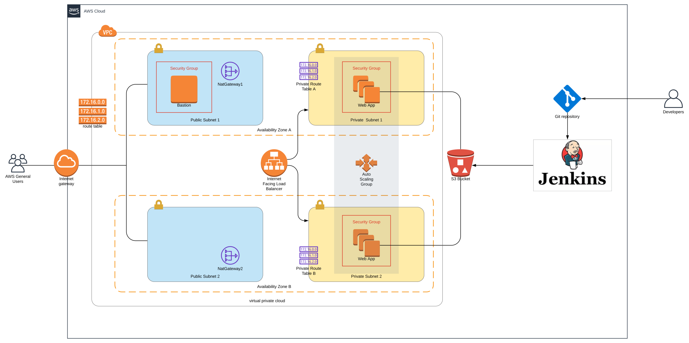

# Udagram - Deploy a High-Availability Web App using CloudFormation

>This is the second project of the nanodegree Cloud Aws Devops.

>The Cloudformation script was built in order to create the following highly avaliable web app using.



> This script will build the entire enviroment including a bastion host where it's possible to reach the machines in the private vpc.


## The files included are:
```
* Udagram-Diagram.svg : Diagram built using https://www.lucidchart.com/
*
* create-stack.sh : This script will check if the stack exists, if it exists it will update it if it does not exists it will try to create the stack

* udagram-network.yaml : Udagram Cloudformation Sctript.
* udagram-network-parameters.json : Udagram CloudFormation Parameters.
```

## Use Intructions:

>All parameters in this script are optional, but in case of any missing parameter it will assume the default values:
>>stack_name="ThisIsJustATest"
>>template_body="udagram-network.yaml"
>>parameters="udagram-network-parameters.json"
>>region="us-west-2"

In order to use the script just run

```sh
> ./create-stack.sh --stack_name=${stack_name} --template_body=${template_body} --parameters=${parameters} --region=${region}
```
